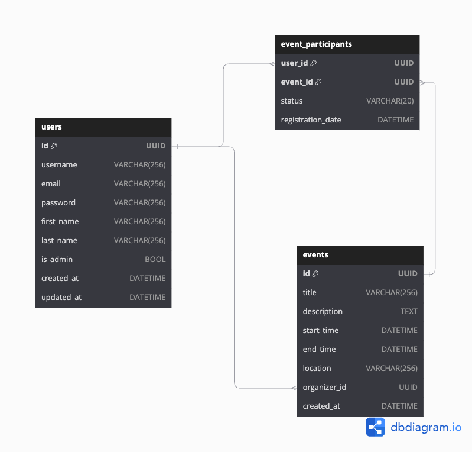

# Организация мероприятий
Проектирование API для Телеграм бота, который организует мероприятия. Основные эндпоинты для управления пользователями, событиями и синхронизацией:

## База данных



### Endpoints

1. **POST /events** — Создание мероприятия
   - **Описание**: Организатор создает новое мероприятие.
   - **Параметры запроса (body)**:
     ```json
     {
       "title": "Название мероприятия",
       "description": "Описание мероприятия",
       "start_time": "2024-09-15T10:00:00Z",
       "end_time": "2024-09-15T12:00:00Z",
       "location": "Адрес проведения",
       "organizer_id": "UUID организатора"
     }
     ```
   - **Ответ**:
     ```json
     {
       "id": "UUID мероприятия",
       "title": "Название мероприятия",
       "description": "Описание мероприятия",
       "start_time": "2024-09-15T10:00:00Z",
       "end_time": "2024-09-15T12:00:00Z",
       "location": "Адрес проведения",
       "organizer_id": "UUID организатора",
       "created_at": "2024-09-01T10:00:00Z"
     }
     ```

2. **GET /events/{id}** — Получение информации о мероприятии
   - **Описание**: Возвращает информацию о конкретном мероприятии по его ID.
   - **Ответ**:
     ```json
     {
       "id": "UUID мероприятия",
       "title": "Название мероприятия",
       "description": "Описание мероприятия",
       "start_time": "2024-09-15T10:00:00Z",
       "end_time": "2024-09-15T12:00:00Z",
       "location": "Адрес проведения",
       "organizer_id": "UUID организатора",
       "created_at": "2024-09-01T10:00:00Z"
     }
     ```

3. **POST /events/{id}/register** — Регистрация участника на мероприятие
   - **Описание**: Пользователь регистрируется на мероприятие.
   - **Параметры запроса (body)**:
     ```json
     {
       "user_id": "UUID пользователя"
     }
     ```
   - **Ответ**:
     ```json
     {
       "event_id": "UUID мероприятия",
       "user_id": "UUID пользователя",
       "status": "registered",
       "registration_date": "2024-09-10T10:00:00Z"
     }
     ```

4. **POST /users** — Регистрация пользователя
   - **Описание**: Регистрация нового пользователя.
   - **Параметры запроса (body)**:
     ```json
     {
       "username": "user123",
       "email": "user@example.com",
       "password": "secure_password",
       "first_name": "Имя",
       "last_name": "Фамилия"
     }
     ```
   - **Ответ**:
     ```json
     {
       "id": "UUID пользователя",
       "username": "user123",
       "email": "user@example.com",
       "first_name": "Имя",
       "last_name": "Фамилия",
       "created_at": "2024-09-01T10:00:00Z"
     }
     ```

5. **POST /login** — Авторизация пользователя
   - **Описание**: Авторизация пользователя по email и паролю.
   - **Параметры запроса (body)**:
     ```json
     {
       "email": "user@example.com",
       "password": "secure_password"
     }
     ```
   - **Ответ**:
     ```json
     {
       "token": "JWT токен"
     }
     ```

6. **GET /events/{id}/participants** — Список участников мероприятия
   - **Описание**: Получение списка всех участников конкретного мероприятия.
   - **Ответ**:
     ```json
     {
       "event_id": "UUID мероприятия",
       "participants": [
         {
           "user_id": "UUID пользователя",
           "status": "registered",
           "registration_date": "2024-09-10T10:00:00Z"
         },
         {
           "user_id": "UUID другого пользователя",
           "status": "registered",
           "registration_date": "2024-09-11T11:00:00Z"
         }
       ]
     }
     ```

7. **PATCH /events/{id}** — Обновление информации о мероприятии
   - **Описание**: Организатор обновляет информацию о мероприятии.
   - **Параметры запроса (body)**:
     ```json
     {
       "title": "Обновленное название мероприятия",
       "description": "Обновленное описание",
       "start_time": "2024-09-15T12:00:00Z",
       "end_time": "2024-09-15T14:00:00Z",
       "location": "Новый адрес"
     }
     ```
   - **Ответ**:
     ```json
     {
       "id": "UUID мероприятия",
       "title": "Обновленное название мероприятия",
       "description": "Обновленное описание",
       "start_time": "2024-09-15T12:00:00Z",
       "end_time": "2024-09-15T14:00:00Z",
       "location": "Новый адрес",
       "updated_at": "2024-09-10T10:00:00Z"
     }
     ```

8. **DELETE /events/{id}** — Удаление мероприятия
   - **Описание**: Организатор удаляет мероприятие.
   - **Ответ**:
     ```json
     {
       "message": "Мероприятие успешно удалено"
     }
     ```

9. **GET /users/{id}** — Получение информации о пользователе
   - **Описание**: Возвращает информацию о конкретном пользователе.
   - **Ответ**:
     ```json
     {
       "id": "UUID пользователя",
       "username": "user123",
       "email": "user@example.com",
       "first_name": "Имя",
       "last_name": "Фамилия",
       "created_at": "2024-09-01T10:00:00Z"
     }
     ```

10. **PATCH /users/{id}** — Обновление профиля пользователя
    - **Описание**: Обновление данных пользователя.
    - **Параметры запроса (body)**:
      ```json
      {
        "first_name": "Новое имя",
        "last_name": "Новая фамилия",
        "email": "new_email@example.com"
      }
      ```
    - **Ответ**:
      ```json
      {
        "id": "UUID пользователя",
        "first_name": "Новое имя",
        "last_name": "Новая фамилия",
        "email": "new_email@example.com",
        "updated_at": "2024-09-10T12:00:00Z"
      }
      ```

11. **DELETE /users/{id}** — Удаление пользователя
    - **Описание**: Удаляет пользователя и его данные.
    - **Ответ**:
      ```json
      {
        "message": "Пользователь успешно удален"
      }
      ```

12. **GET /users/{id}/events** — Список мероприятий пользователя
    - **Описание**: Получение списка мероприятий, в которых пользователь участвует или которые он организует.
    - **Ответ**:
      ```json
      {
        "organized_events": [
          {
            "id": "UUID мероприятия",
            "title": "Название мероприятия",
            "start_time": "2024-09-15T10:00:00Z"
          }
        ],
        "participated_events": [
          {
            "id": "UUID мероприятия",
            "title": "Название мероприятия",
            "start_time": "2024-09-20T14:00:00Z",
            "status": "registered"
          }
        ]
      }
      ```

### Основные категории эндпоинтов:
- **/users**: управление пользователями (регистрация, авторизация, обновление профиля).
- **/events**: управление мероприятиями (создание, обновление, регистрация участников).
- **/participants**: работа с участниками мероприятий.


Для генерации случайных ключей (token secret) можно использовать

```python
python -c "import secrets; print(secrets.token_hex())"
```